# Synthetic Data Project Overview

## What This Project Is

This project builds an automated, iteration-driven pipeline to generate high-quality synthetic Q&A data for a Home DIY Repair assistant.

At a high level, the system:
- Generates structured repair guidance as question/answer records.
- Validates and quality checks generated items before expensive labeling.
- Labels each item on 6 quality dimensions using both:
  - Human reviewer labels
  - An independent LLM-as-Judge
- Logs traces, per-step outcomes, and category-level diagnostics.
- Uses those diagnostics to retrace weak categories and iteratively improve prompts.

The end result is not just synthetic data generation, but a measured quality-improvement loop backed by charts, agreement metrics, and iteration logs.

## Purpose of the Project

The purpose is to create a system that can:
- Produce realistic DIY repair Q&A data at scale.
- Explicitly evaluate what makes guidance good vs bad.
- Calibrate an LLM judge against human standards across the same 6 quality dimensions.
- Demonstrate data-driven prompt improvement over iterations, instead of relying on subjective prompt edits.

## Tech Stack

- Python: 3.13 (project venv)
- Instructor: structured output / schema-safe LLM responses
- Matplotlib + Seaborn: charting and visualization
- Pydantic: schema and structural validation
- Dataset generation model: llama-3.3-70b-versatile
- LLM-as-Judge model: openai/gpt-oss-120b

## Running the Project

For environment setup, dependency installation, and step-by-step commands to run the generator, validator, judge, analysis scripts, tests, and the overall pipeline, see [README.md](/Users/bvsaker/Dev/ai-bootcamp/mini-project1/README.md).

## Core Data Schema (7 Fields)

Each generated item is expected to conform to a 7-field structure used throughout generation, validation, and judging:
- trace_id
- category
- question
- answer
- tools_required
- steps
- safety_info
- tips

Notes:
- In implementation, `trace_id` is used as the item identity key throughout labeling/analysis.
- Structural gate constraints include: `steps >= 3`, `tools_required >= 1`, `tips >= 1`, non-empty `safety_info`.

## Pipeline: Six Sequential Steps

### Step 1: Generation

A single structured prompt is sent to the generation LLM (with Instructor for schema-safe output) to produce Q&A items matching the schema above.

The prompt is parameterized by repair category so all 5 categories are covered:
- Appliance
- Electrical
- Plumbing
- HVAC
- General Home

### Step 2: Data Quality (First-Pass Gate)

Every generated item is validated before labeling.

Per-item checks:
- Schema/structural validation (Pydantic): all required fields, list lengths, and non-empty safety info.
- Lightweight per-quality-dimension pre-checks, for example:
  - Safety Specificity: safety text length
  - Tool and Tip lists must exist

Batch-level checks:
- Deduplication within generated set
- Distribution thresholds across categories
  - Target: each category >= 20% of the set

Gate policy:
- Items failing any per-item gate are dropped.
- If pass rate is low or categories are underrepresented, revise prompt/model and regenerate Step 1.
- Only Step-2-pass items proceed to Steps 3 and 4.

### Step 3: Human Labeling (6 Quality Dimensions)

Create Python CLI to guide a reviewer through each item and record binary pass/fail labels on all 6 quality dimensions. Labels are stored by `trace_id`.

### Step 4: LLM-as-Judge (6 Quality Dimensions)

An independent judge prompt with lower temperature and structured output scores the same 6 quality dimensions per item.

### Step 5: Analysis and Visualization

Aggregate:
- Human labels
- LLM judge labels
- Step-2 gate outcomes

Compute category-level metrics:
- Per-quality-dimension pass rate
- Per-quality-dimension human/LLM agreement
- Category distribution

Segment by:
- Category
- Prompt variant (baseline vs corrected)

Produce charts as the diagnostic input to Step 6.

### Step 6: Iteration/Pipeline (Judge Calibration -> Generator Correction)

Two-phase loop:

### Phase 1: Judge Tuning (Calibration)

Objective:
- Calibrate the LLM judge so human-vs-LLM agreement is >= 80% per quality dimension.

Steps and reasoning:
1. Pick dataset generation model and create initial prompts and dataset.
2. Validate JSON structure and deduplicate QA pairs.
3. Iterate generation until validation metrics exceed 95%.
4. Sample 20+ QA pairs with even category representation.
5. Select judge model and create judge prompt.
6. Run judge on sampled dataset.
7. Evaluate agreement and iterate judge prompt until metrics pass.
8. Only then move to Phase 2.

Charts used in Phase 1:
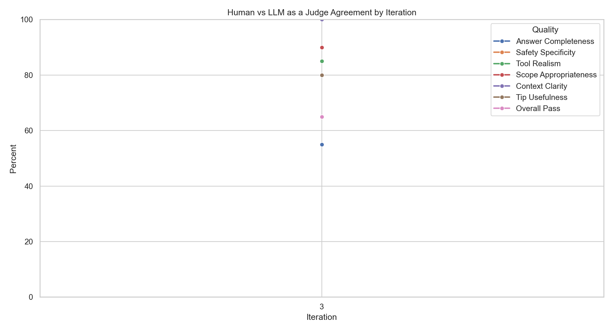
- Per-iteration agreement charts:
  
  <a href="visualizations/human_vs_llm_agreement_iter_3.png">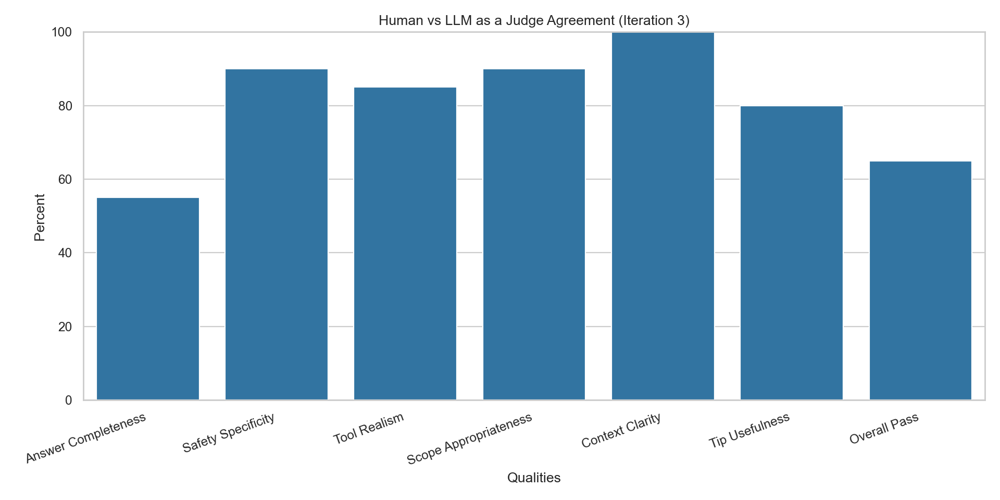</a>
  <a href="visualizations/human_vs_llm_agreement_iter_4.png">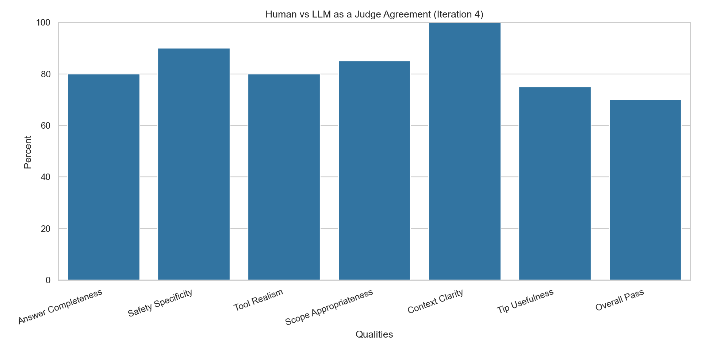</a>

  <a href="visualizations/human_vs_llm_agreement_iter_5.png">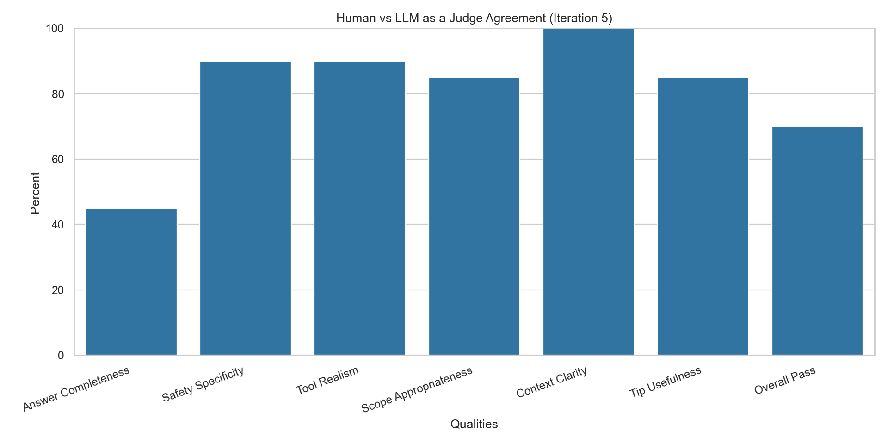</a>
  <a href="visualizations/human_vs_llm_agreement_iter_6.png">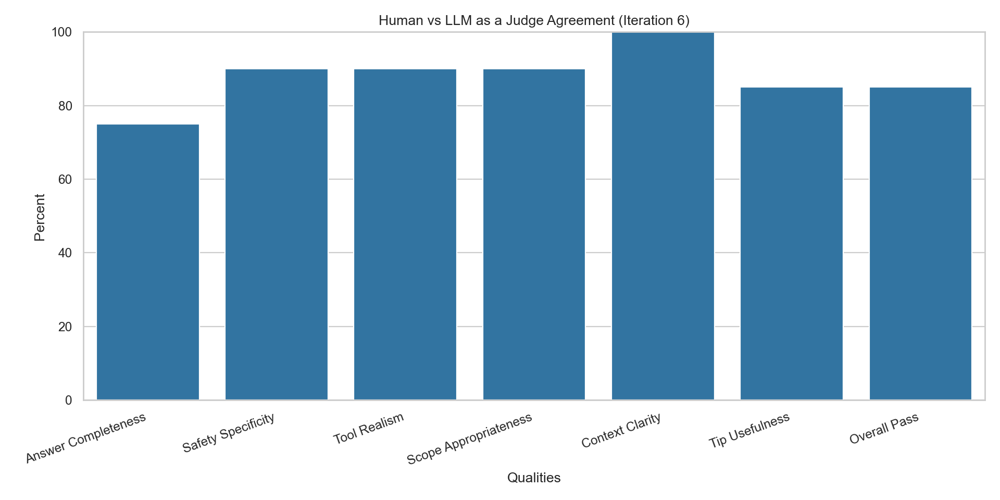</a>

  <a href="visualizations/human_vs_llm_agreement_iter_7.png">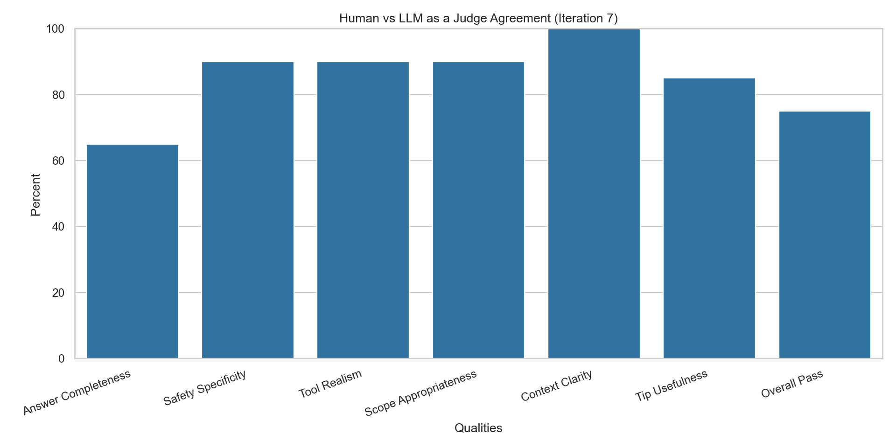</a>

Notes: 
- Iterations 1 and 2 did not generate successful datasets because of JSON validation
errors that were corrected with updated prompts and increasing the completion
token max size.
- Iteration 6 was the best tuned judge and this is the judge that was used to
judge the dataset.  Although, human and LLM agreement were at 75% and not at the desired
80%, this was deemed acceptable because GPT OSS has a knowledge cutoff and does not perform as efficiently as OpenAI’s closed source models for this type of LLM-as-a-judge task. Because of that, I do not think GPT OSS is the best choice if the goal is to achieve higher judge accuracy. For higher accuracy, I would suggest using GPT-5.1, or one of the latest Qwen or DeepSeek models.

### Phase 2: Generator Prompt Correction

Objective:
- Use calibrated judge to improve dataset generation quality until dataset-level metrics pass.

Steps and reasoning:
1. Use calibrated judge to score generated datasets.
2. Use chart diagnostics to track metric progression.
3. Update generation prompts and regenerate datasets iteratively.
4. Continue until pass thresholds are reached or marginal gains plateau.

Charts used in Phase 2:
- Judge quality pass-rate charts:
  
  <a href="visualizations/judge_pass_rate_all_qualities_iter_8.png">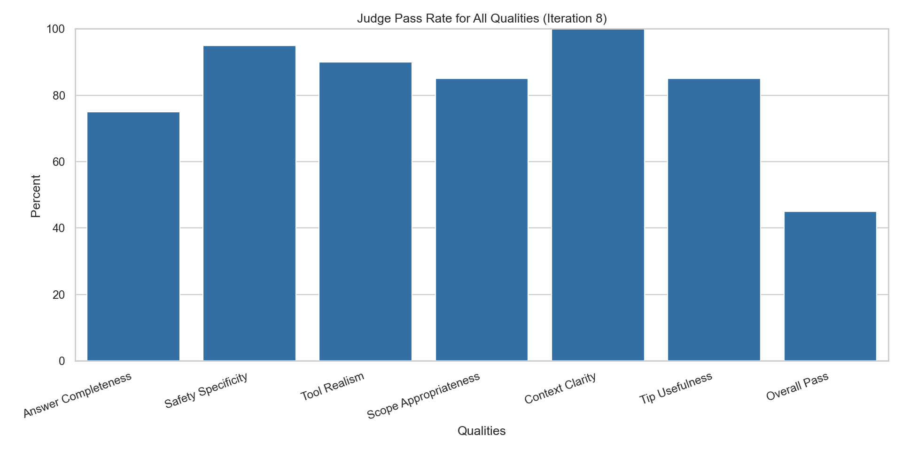</a>
  <a href="visualizations/judge_pass_rate_all_qualities_iter_9.png">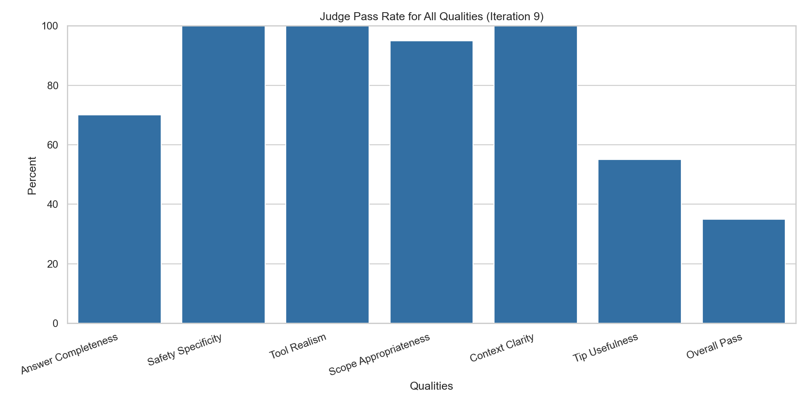</a>

  <a href="visualizations/judge_pass_rate_all_qualities_iter_10.png">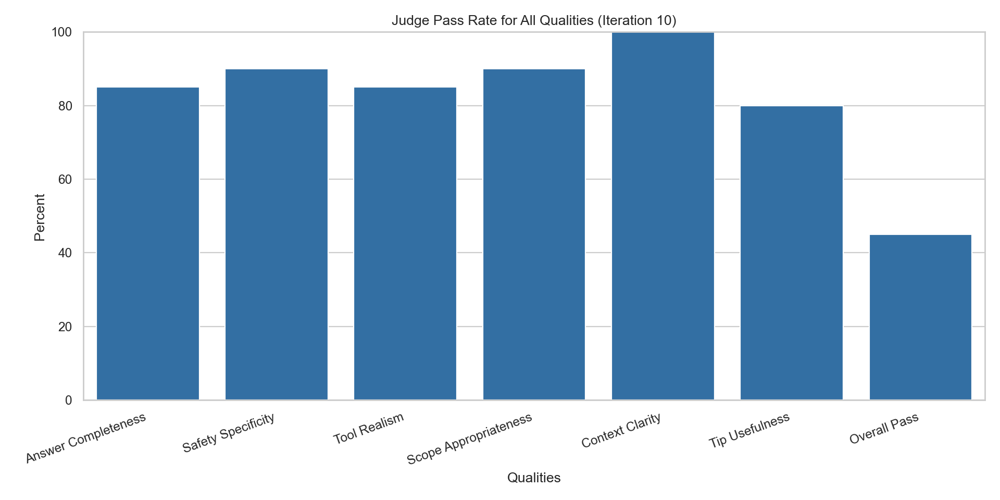</a>
  <a href="visualizations/judge_pass_rate_all_qualities_iter_11.png">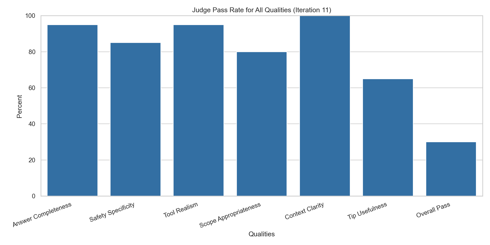</a>

  <a href="visualizations/judge_pass_rate_all_qualities_iter_12.png">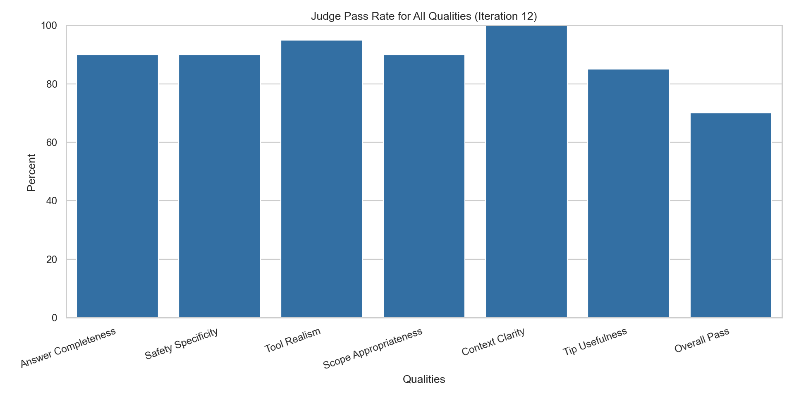</a>
  <a href="visualizations/judge_pass_rate_all_qualities_iter_13.png">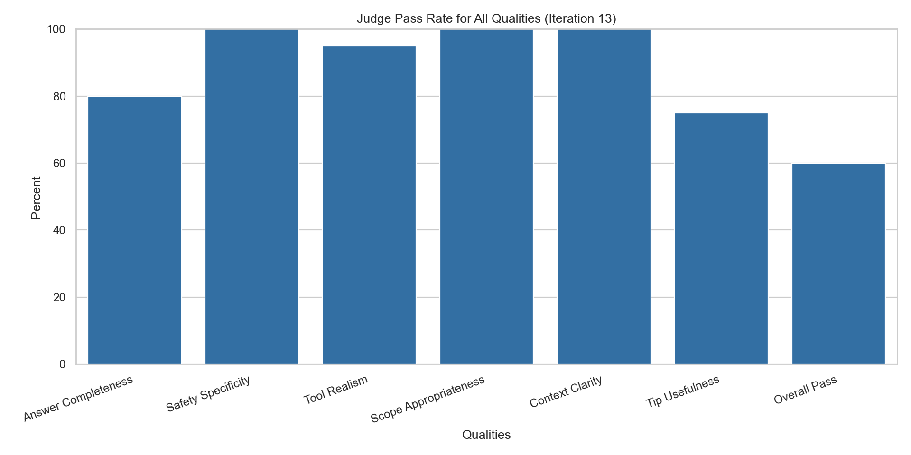</a>
- Failure heatmaps:
  
  <a href="visualizations/failed_quality_heatmap_iter_8.png">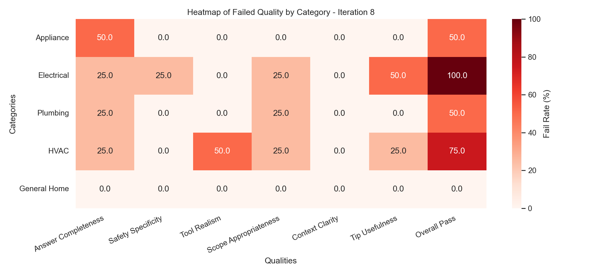</a>
  <a href="visualizations/failed_quality_heatmap_iter_9.png">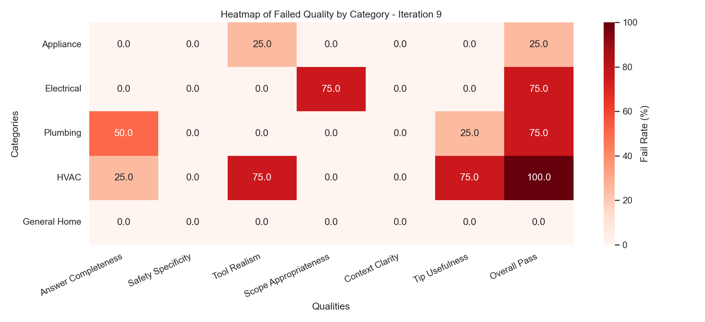</a>

  <a href="visualizations/failed_quality_heatmap_iter_10.png">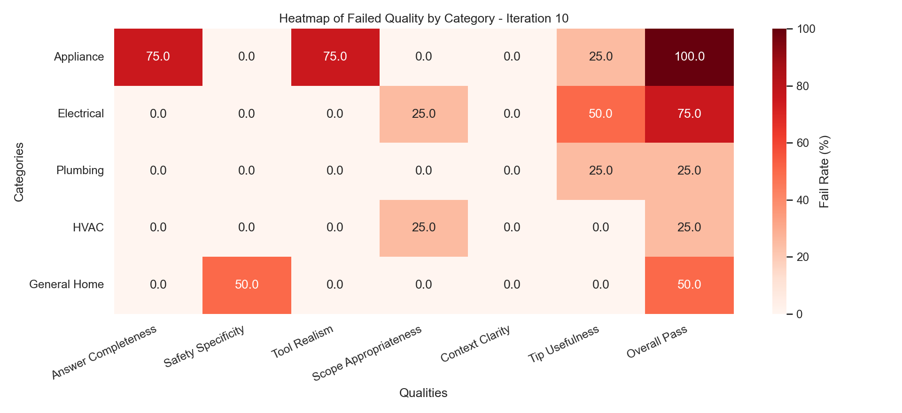</a>
  <a href="visualizations/failed_quality_heatmap_iter_11.png">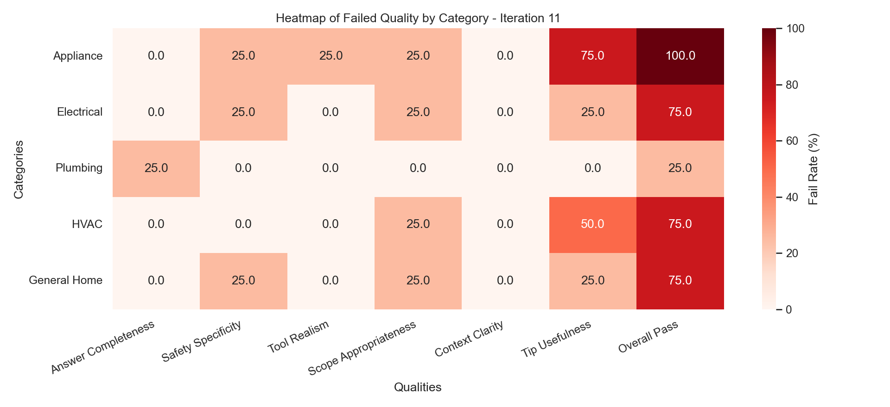</a>

  <a href="visualizations/failed_quality_heatmap_iter_12.png">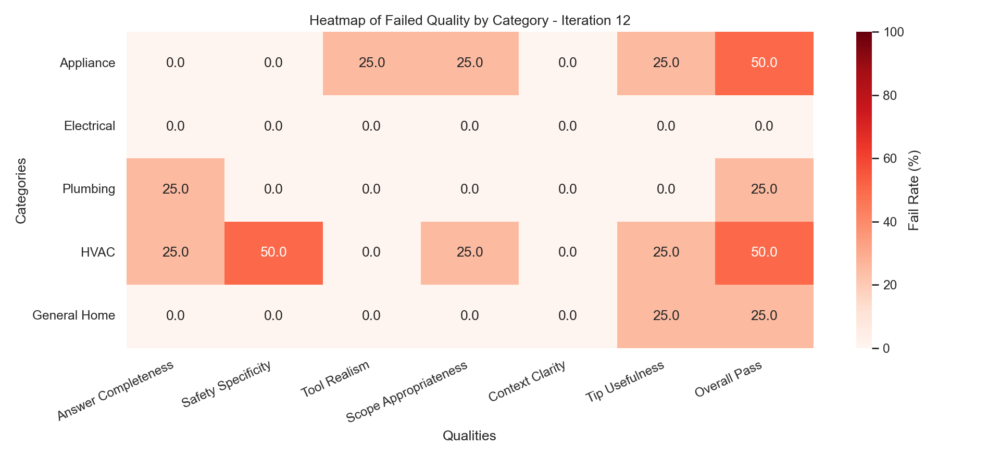</a>
  <a href="visualizations/failed_quality_heatmap_iter_13.png">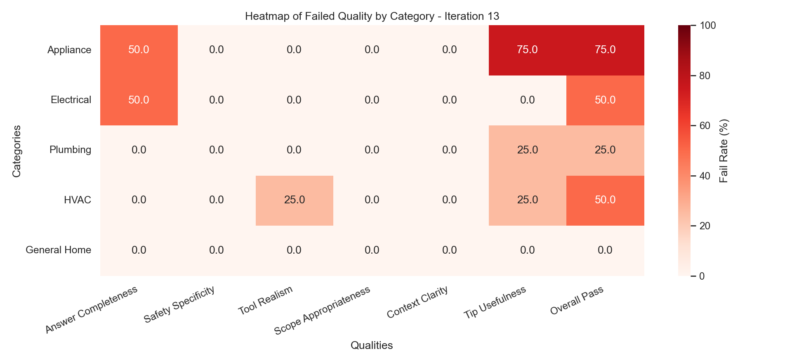</a>

Notes:
- Iteration 12 was the best iteration and the one chosen for the dataset.  All 
qualities had a 80%> pass rate. However, the overall dataset pass rate for the 
dataset was 70%.  This was deemed acceptable because GPT OSS has a knowledge cutoff and does not perform as efficiently as OpenAI’s closed source models for this type of LLM-as-a-judge task.

## Quality Targets and Acceptance Criteria

- Structural validation pass rate: >= 95% of generated items pass schema checks
- Coverage across categories: all 5 repair categories represented
- Step-2 quality gate: schema + per-quality-dimension pre-checks + dedup + category >= 20% target
- Quality dimensions evaluated: all 6 quality dimensions scored by both human and LLM judge
- Overall quality pass rate (LLM judge): >= 80% pass all 6 quality dimensions
- Human vs LLM agreement: >= 80% per quality dimension
- Minimum dataset size per run: >= 50 Q&A pairs
- Minimum human-labeled subset: >= 20 items

## 6 Quality Dimensions

- D1 Answer Completeness
- D2 Safety Specificity
- D3 Tool Realism
- D4 Scope Appropriateness
- D5 Context Clarity
- D6 Tip Usefulness

## Iteration History Summary and Links

### Compact Iteration Matrix

| Iteration | Phase | Dataset Log | Prompt Artifact | Judge Prompt | Key Charts |
|---|---|---|---|---|---|
| 1 | Phase 1 (Judge Calibration) | [log](logs/dataset_log_1.jsonl) | setup | [judge 1](templates/judge_prompt_1.json) | n/a |
| 2 | Phase 1 (Judge Calibration) | [log](logs/dataset_log_2.jsonl) | setup | [judge 2](templates/judge_prompt_2.json) | n/a |
| 3 | Phase 1 (Judge Calibration) | [log](logs/dataset_log_3.jsonl) | n/a | [judge 3](templates/judge_prompt_3.json) | [agreement](visualizations/human_vs_llm_agreement_iter_3.png), [pass-rate](visualizations/pass_rate_all_qualities_iter_3.png) |
| 4 | Phase 1 (Judge Calibration) | [log](logs/dataset_log_4.jsonl) | n/a | [judge 4](templates/judge_prompt_4.json) | [agreement](visualizations/human_vs_llm_agreement_iter_4.png), [pass-rate](visualizations/pass_rate_all_qualities_iter_4.png) |
| 5 | Phase 1 (Judge Calibration) | [log](logs/dataset_log_5.jsonl) | n/a | [judge 5](templates/judge_prompt_5.json) | [agreement](visualizations/human_vs_llm_agreement_iter_5.png), [pass-rate](visualizations/pass_rate_all_qualities_iter_5.png) |
| 6 | Phase 1 (Judge Calibration) | [log](logs/dataset_log_6.jsonl) | n/a | [judge 6](templates/judge_prompt_6.json) | [agreement](visualizations/human_vs_llm_agreement_iter_6.png), [pass-rate](visualizations/pass_rate_all_qualities_iter_6.png) |
| 7 | Phase 1 (Judge Calibration) | [log](logs/dataset_log_7.jsonl) | [prompt](logs/dataset_prompt_7.log) | [judge 7](templates/judge_prompt_7.json) | [agreement](visualizations/human_vs_llm_agreement_iter_7.png), [pass-rate](visualizations/pass_rate_all_qualities_iter_7.png) |
| 8 | Phase 2 (Generator Correction) | [log](logs/dataset_log_8.jsonl) | [prompt](logs/dataset_prompt_8.log), [report](logs/dataset_prompt_8-9_report.md) | [judge 6](templates/judge_prompt_6.json) | [judge-pass](visualizations/judge_pass_rate_all_qualities_iter_8.png), [heatmap](visualizations/failed_quality_heatmap_iter_8.png) |
| 9 | Phase 2 (Generator Correction) | [log](logs/dataset_log_9.jsonl) | [prompt](logs/dataset_prompt_9.log), [report](logs/dataset_prompt_9-10_report.md) | [judge 6](templates/judge_prompt_6.json) | [judge-pass](visualizations/judge_pass_rate_all_qualities_iter_9.png), [heatmap](visualizations/failed_quality_heatmap_iter_9.png) |
| 10 | Phase 2 (Generator Correction) | [log](logs/dataset_log_10.jsonl) | [prompt](logs/dataset_prompt_10.log), [report](logs/dataset_prompt_10-11_report.md) | [judge 6](templates/judge_prompt_6.json) | [judge-pass](visualizations/judge_pass_rate_all_qualities_iter_10.png), [heatmap](visualizations/failed_quality_heatmap_iter_10.png) |
| 11 | Phase 2 (Generator Correction) | [log](logs/dataset_log_11.jsonl) | [prompt](logs/dataset_prompt_11.log), [report](logs/dataset_prompt_11-12_report.md) | [judge 6](templates/judge_prompt_6.json) | [judge-pass](visualizations/judge_pass_rate_all_qualities_iter_11.png), [heatmap](visualizations/failed_quality_heatmap_iter_11.png) |
| 12 | Phase 2 (Generator Correction) | [log](logs/dataset_log_12.jsonl) | [prompt](logs/dataset_prompt_12.log), [report](logs/dataset_prompt_12-13_report.md) | [judge 6](templates/judge_prompt_6.json) | [judge-pass](visualizations/judge_pass_rate_all_qualities_iter_12.png), [heatmap](visualizations/failed_quality_heatmap_iter_12.png) |
| 13 | Phase 2 (Generator Correction) | [log](logs/dataset_log_13.jsonl) | [prompt](logs/dataset_prompt_13.log) | [judge 6](templates/judge_prompt_6.json) | [judge-pass](visualizations/judge_pass_rate_all_qualities_iter_13.png), [heatmap](visualizations/failed_quality_heatmap_iter_13.png) |

Detailed iteration summaries:
- [logs/iteration_history.md](logs/iteration_history.md)
- [logs/iteration_history.log](logs/iteration_history.log)

Reference files already linked in the matrix above:
- dataset logs (`logs/dataset_log_*.jsonl`)
- dataset prompt logs/diffs/reports (`logs/dataset_prompt_*`)
- judge prompt versions (`templates/judge_prompt_*.json`)

## Lessons Learned

- LLM selected must contain a sufficient level of parameters or generated datasets will not be useful and specific enough.  I chose Llama-3.3-70B-versatile because lower parameter numbers were unsuccessful.
- LLM for the judge needs to be a reasoning model and more capable than that used by the dataset generator LLM.  I chose gpt-oss-120B which is a reasoning LLM with 120 billion parameters.
- Batch processing by category with 10 at a time for the Q&A DIY pairs was much more efficient and faster since queries were reduced from 10 to 1.  It also reduced redundant Q&A pairs.
- The temperature used for the dataset needed higher (ie .7) for greater creativity and lower (ie. .3) for more deterministic judging.
- Calibrate the judge first. Generator tuning is unreliable when judge-human agreement is below threshold.
- Changes that fix one quality dimension can regress another. Always read metrics per category x quality dimension, not only aggregate scores.
- Small, targeted prompt edits are easier to reason about than broad rewrites.
- Segment-level diagnostics (category x quality) are the fastest way to find high-impact corrections.
- Strict first-pass quality gates reduce wasted human-labeling effort and make iteration loops cheaper.
- Track artifacts per iteration (logs, prompt diffs, charts) so regressions and improvements are auditable.
